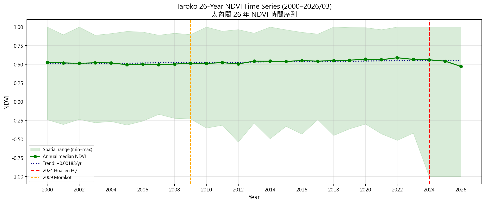
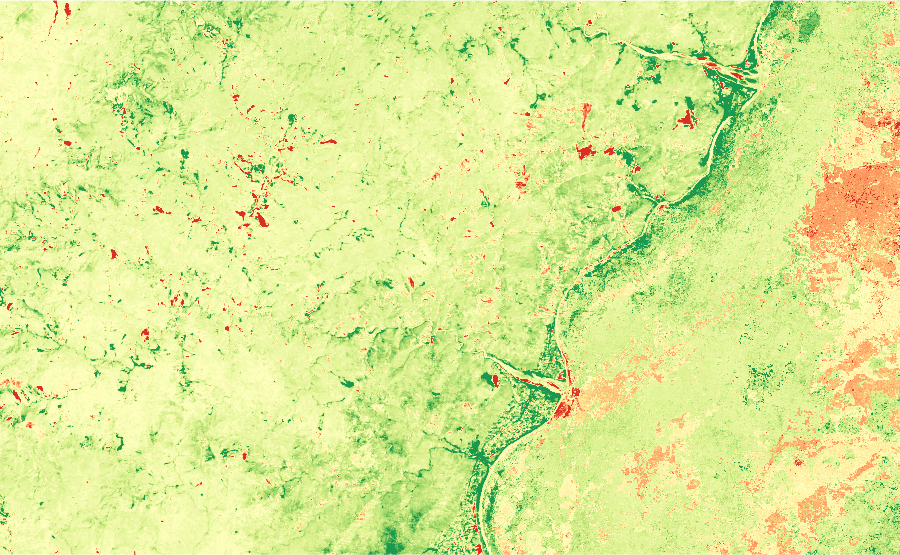
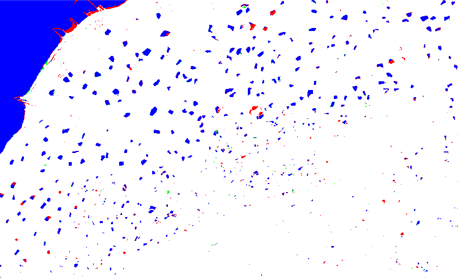
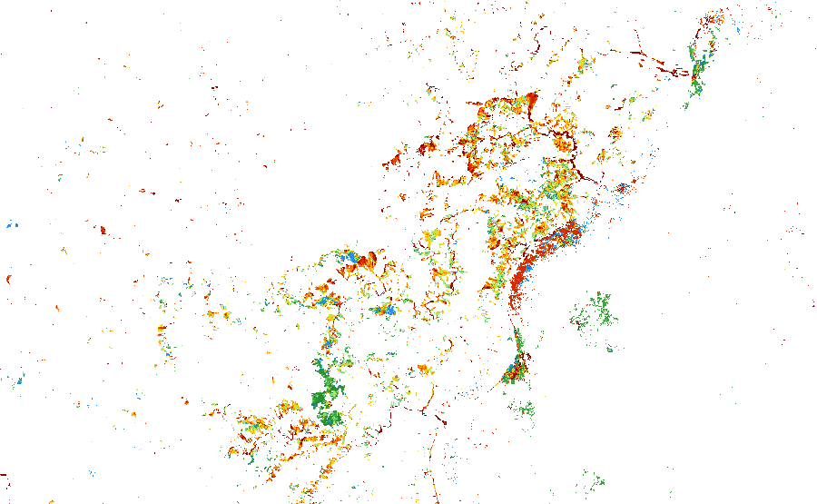
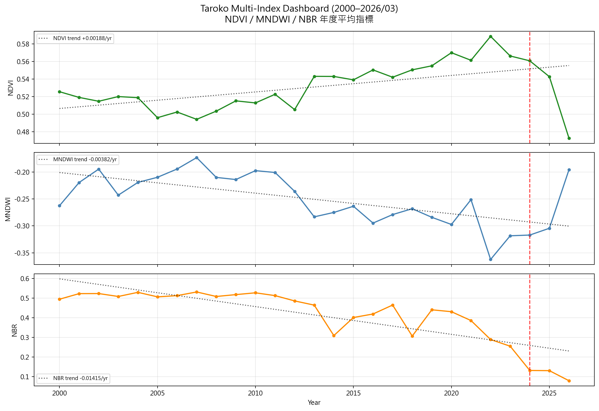
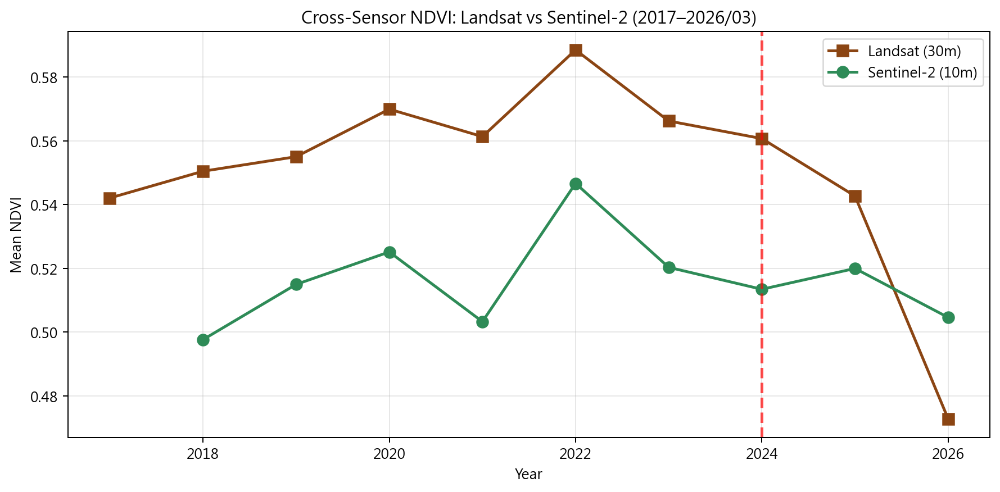
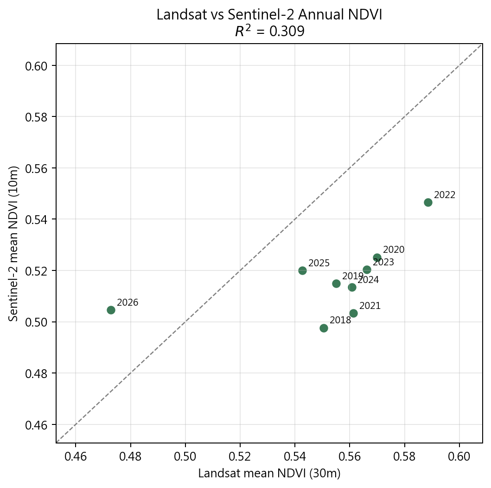

# Week 14 Homework Report: ARIA v9.5 - The Resilience Monitor

**課程：** 遙測與空間資訊之分析與應用  
**主題：** Landsat 多年代趨勢分析、桃園埤塘消失與植被韌性監測  
**研究區：** 秀林/太魯閣山區；桃園台地  
**Notebook:** `Week14-Homework-Completed.ipynb` (homework submission); `Week14-Student.ipynb` (class exercise)  
**輸出資料夾：** `Week14_outputs/`

## 摘要

本週作業依照 0526 講義 ARIA v9.5 流程，將 W13 的 Sentinel-2 六年時序分析擴展為 Landsat L5/L7/L8/L9 的 2000-2026/03 長期監測。核心流程包含：四代 Landsat 波段調和、Collection 2 Level 2 反射率 scale factor 校正、`QA_PIXEL` bit 3/4 雲與雲影遮罩、年度 NDVI/MNDWI/NBR 指標、逐像素 `linearFit()` 趨勢、桃園 MNDWI 水頻率與埤塘消失偵測、2024 花蓮地震後 recovery ratio，以及 Landsat/Sentinel-2 跨感測器比較。

本次在太魯閣 AOI 共處理 **878 張 Landsat** 影像（L5 178、L7 387、L8 233、L9 80）。年度 NDVI 線性趨勢為 **+0.00188 NDVI/year**，2000-2026 趨勢估計增加 **+0.0488**，顯示整體為緩慢 greening；但逐像素分析仍有 **10.3%** 面積為 browning。桃園台地完整 AOI 估計 2000-2005 至 2021-2026/03 期間埤塘/水面淨減 **426.0 ha**；223 個已知埤塘點位中，MNDWI recent-water 偵測到 199 個，偵測率 **89.2%**。植被韌性分析顯示 2024 地震後顯著受損像元約 **91.94 km²**，平均 recovery ratio **0.415**，仍有 **57.1%** 受損像元屬退化或慢速恢復。

## Data And Workflow

- **Landsat collections：** `LANDSAT/LT05/C02/T1_L2`、`LANDSAT/LE07/C02/T1_L2`、`LANDSAT/LC08/C02/T1_L2`、`LANDSAT/LC09/C02/T1_L2`
- **時間範圍：** 2000-01-01 至 2026-03-31；2026 為部分年度，解讀時需特別標註。
- **Taroko AOI：** `[121.34526379253053, 24.046021742135874, 121.85149217685861, 24.35767637905926]`
- **Taoyuan full AOI：** `[120.94, 24.83, 121.35, 25.08]`
- **Taoyuan urban corridor：** `[121.00, 24.88, 121.28, 25.05]`
- **Band harmonization：** L5/L7 `SR_B1/B2/B3/B4/B5/B7` -> `Blue/Green/Red/NIR/SWIR1/SWIR2`；L8/L9 `SR_B2/B3/B4/B5/B6/B7` -> 同一組共同名稱。
- **Scale factor：** `DN * 0.0000275 + (-0.2)`，並 clamp 到 0-1 反射率範圍。
- **Cloud mask：** `QA_PIXEL` bit 3 為 cloud、bit 4 為 cloud shadow，兩者皆為 0 才保留。

## Task 1: Landsat Harmonization And 26-Year NDVI



Landsat 四代影像完成波段調和後，所有影像皆具有 `Blue, Green, Red, NIR, SWIR1, SWIR2, QA_PIXEL` 共同 band name，因此 NDVI 可用一致公式 `(NIR - Red) / (NIR + Red)` 計算。年度 NDVI 以每年 median composite 後取 AOI 空間平均。

主要結果：

| 指標 | 數值 |
|---|---:|
| Landsat total images | 878 |
| L5 / L7 / L8 / L9 | 178 / 387 / 233 / 80 |
| 26-year NDVI trend | +0.00188 NDVI/year |
| Trend-estimated total change | +0.0488 |
| Highest annual mean NDVI | 2022, 0.5886 |
| Lowest annual mean NDVI | 2026, 0.4728 |
| 2024 earthquake year mean NDVI | 0.5607 |

2000-2026/03 的整體趨勢是緩慢 greening。2005、2007、2012 與 2026 有較低 NDVI，其中 2026 只到 3 月，影像數僅 8 張，受季節與資料不完整影響，不應直接視為全年退化。2009 莫拉克年平均 NDVI 為 0.5152，2024 地震年為 0.5607；兩者在 AOI 年平均折線上並非最強低谷，說明災害訊號被大面積森林與季節差異稀釋。因此，事件影響應搭配逐像素趨勢、ΔNDVI 與 recovery ratio 判讀，而不是只看整體平均。

## Task 2: Pixel-Level Linear Trend Analysis



本段依講義使用年度 NDVI ImageCollection 加入 `time` band，再以 `ee.Reducer.linearFit()` 對每個像素計算 2000-2026/03 的 NDVI slope。分類門檻設為：

- `slope > 0.001`：greening
- `-0.001 <= slope <= 0.001`：stable
- `slope < -0.001`：browning

結果如下：

| Class | Area (km²) | Percent |
|---|---:|---:|
| Greening | 1351.34 | 76.1% |
| Browning | 183.11 | 10.3% |
| Stable | 240.84 | 13.6% |
| Valid total | 1775.29 | 100.0% |

這個結果與 Task 1 的整體 greening 一致，但空間圖顯示 browning 不是不存在，而是集中在特定位置，例如河谷、道路切坡、裸露坡面與持續受侵蝕區。W13 的 Sentinel-2 六年趨勢適合回答「地震後哪裡變化最明顯」，但 W14 的 Landsat 二十六年趨勢能判斷「這個像元是長期退化，還是短期事件造成」。因此，W13 與 W14 的差異不是誰取代誰，而是短期細節與長期背景的互補。

GeoTIFF Drive export 已啟動並完成：

- `Week14_taroko_ndvi_trend_26yr` - `SUCCEEDED`

## Task 3: Taoyuan Pond Disappearance With MNDWI




桃園分析使用 MNDWI `(Green - SWIR1) / (Green + SWIR1)`，並以 `MNDWI > 0.1` 判為水體。先建立 2000-2026/03 每年水體 mask，再計算水頻率圖；接著比較 early period（2000-2005）與 recent period（2021-2026/03）之 median MNDWI water mask。

面積結果：

| Region | Stable water (ha) | Lost ponds (ha) | New water (ha) | Net change (ha) |
|---|---:|---:|---:|---:|
| Taoyuan full | 19047.56 | 588.80 | 162.80 | -425.99 |
| Urban corridor | 4034.77 | 352.19 | 50.63 | -301.57 |

完整桃園 AOI 的淨水面變化為 **-426.0 ha**，其中中壢/新屋/高鐵走廊就佔 **-301.6 ha**，顯示消失埤塘高度集中在都市化走廊。新增水體面積小於消失面積，可能包含新設滯洪池、工程開挖積水、整修後農塘或季節性水田；因此不宜直接把所有 green 像元解讀成永久水塘增加。

驗證結果：

| Known ponds | MNDWI detected | Detection rate |
|---:|---:|---:|
| 223 | 199 | 89.2% |

MNDWI 對大部分已知埤塘有效，但可能漏掉小面積水體、混合像元、植被覆蓋水面或陰影干擾。都市防洪上，埤塘被填平代表分散式蓄洪容量下降，不透水面增加，使短延時強降雨下的逕流尖峰更高，排水系統更容易超載。這也是講義強調桃園埤塘不只是文化景觀，也是都市韌性基礎設施的原因。

## Task 4: Vegetation Resilience Metrics



依講義定義三期：

- **Baseline：** 2020-01-01 至 2024-03-31
- **Impact：** 2024-04-01 至 2024-12-31
- **Recovery：** 2025-06-01 至 2026-03-31

公式：

```text
Recovery Ratio = (Recovery_NDVI - Impact_NDVI) / (Baseline_NDVI - Impact_NDVI)
```

本作業只評估 `Baseline - Impact > 0.1` 的顯著受損像元。結果如下：

| Class | Area (km²) | Percent |
|---|---:|---:|
| Degrading (< 0) | 16.15 | 17.6% |
| Slow recovery (0-0.5) | 36.36 | 39.5% |
| Recovering (0.5-1.0) | 27.17 | 29.6% |
| Exceeded (> 1.0) | 11.93 | 13.0% |
| Damaged pixels evaluated | 91.94 | 100.0% |
| Mean recovery ratio | 0.415 | |

受損像元中，退化與慢速恢復合計 **57.1%**，代表超過一半的顯著受損地區尚未恢復到震前一半以上。這些區域多半是陡峭峽谷壁、河道兩側裸露堆積、道路切坡、崩塌源頭或持續受沖刷的坡面；即使經過 2025-2026 的恢復期，NDVI 仍偏低。相對地，recovering 與 exceeded 區域可能位於較緩坡面、谷地邊緣或仍保有土壤的崩塌堆積面，植被可快速長草或灌木化。

復育建議是分級處理：靠近道路、溪流、聚落或保全對象，且 recovery ratio 低的地區應優先工程穩定與主動復育；recovery ratio 已高且遠離保全對象的區域，則可採自然恢復監測，避免過度介入。

GeoTIFF Drive export 已啟動並完成：

- `Week14_taroko_recovery_ratio` - `SUCCEEDED`

## Bonus 1: Multi-Index Dashboard



本次同時計算 NDVI、MNDWI、NBR。NDVI 長期緩慢上升，但 NBR 在 2014 以後波動較明顯，2024-2026 更低，顯示 NBR 對裸露、擾動或 SWIR2 反應更敏感。MNDWI 在太魯閣 AOI 多為負值，符合山區植被/裸地為主、水面比例較低的特性；若要分析水體變化，桃園埤塘案例比太魯閣整體 AOI 更適合。

## Bonus 2: NDVI 26-Year Time-Lapse Animation

產出 GIF：

- `Week14_outputs/bonus2_taroko_ndvi_26yr_timelapse.gif`

動畫共 27 幀（2000-2026），每幀標示年份，並特別標記 2009 Morakot 與 2024 Hualien EQ。最明顯的三個視覺重點是：第一，太魯閣山區長期仍以高 NDVI 森林為主；第二，河谷、海岸與裸露坡面在多年中反覆呈現低 NDVI；第三，2024 後局部紅黃區變多，但整體山區並非全面崩壞，需靠 recovery ratio 才能判斷哪些受損地真正未恢復。

## Bonus 3: Landsat And Sentinel-2 Cross-Sensor Comparison





跨感測器重疊時段使用 2017-2026/03 Sentinel-2 與 Landsat。Sentinel-2 共載入 **247 張**，同時段 Landsat 為 **381 張**。2018-2025 多數年份 Sentinel-2 年平均 NDVI 低於 Landsat；2026 因 Landsat 只有 1-3 月資料且影像數少，Landsat 0.4728 反而低於 Sentinel-2 0.5046。散佈圖 `R² = 0.309`，代表兩者有部分一致，但因解析度、雲遮罩、季節取樣與感測器光譜響應不同，不能直接把數值視為完全等價。

ΔNDVI < -0.15 的損害面積：

| Sensor | Resolution | Damage area (km²) |
|---|---:|---:|
| Landsat | 30 m | 70.07 |
| Sentinel-2 | 10 m | 81.11 |

Sentinel-2 面積較大，推測是 10 m 解析度能捕捉更多細碎崩塌面、道路切坡與河谷邊坡。Landsat 適合長期趨勢與大尺度熱區，Sentinel-2 適合震後細節定位；兩者合用才符合災害監測需求。

## Cross-Week Integration Summary

W6 的 Kriging 解決空間缺口：雨量站是點，但防災需要連續雨量面。W14 的 GEE Landsat 時序解決時間缺口：單張影像是快照，但地震、颱風、都市化與復育都是跨年的過程。兩者合在一起，能建立 `x, y, time, value` 的時空觀點。

從 W8 到 W14，ARIA 的思維由「單張影像裡有什麼」逐步變成「這個地景如何演變」。W8 單景 NDVI 能判斷植被狀態，W9 兩景 ΔNDVI 能看變化，W10 SAR 補足雲雨與夜間觀測，W12 分類器能把地表狀態轉為土地覆蓋類別，W13 GEE Sentinel-2 建立六年高解析時序，W14 Landsat 則補上二十六年背景線與韌性。短期 Sentinel-2 看到的是地震後細節，長期 Landsat 則回答「這些變化是否超出歷史脈絡」。

限制也很明確：Landsat 30 m 會混合小型崩塌、道路、水體與陰影，不如 Sentinel-2 10 m 精細；L7 2003 後 SLC-off 可能造成條帶缺口，雖然 annual median 可減輕但不能完全消除；山區雲量高，使部分年份有效觀測較少，2026 又是部分年度。因此，本作業的結論應視為雲端遙測的長期監測成果，後續若要支援工程決策，仍需高解析影像、DEM slope/aspect、道路/溪流資料與現地調查交叉驗證。

## Output Checklist

- `Week14-Student.ipynb` - 已完成並執行，13 個 code cells 皆有輸出，0 個錯誤輸出。
- `Week14_outputs/00_week14_contact_sheet.png`
- `Week14_outputs/01_taroko_ndvi_26yr_timeseries.png`
- `Week14_outputs/02_taroko_ndvi_slope_map.png`
- `Week14_outputs/03_taoyuan_water_frequency.png`
- `Week14_outputs/04_taoyuan_pond_change_map.png`
- `Week14_outputs/05_taroko_recovery_ratio_map.png`
- `Week14_outputs/06_landsat_delta_ndvi_2024.png`
- `Week14_outputs/07_sentinel2_delta_ndvi_2024.png`
- `Week14_outputs/bonus1_multi_index_dashboard.png`
- `Week14_outputs/bonus2_taroko_ndvi_26yr_timelapse.gif`
- `Week14_outputs/bonus3_cross_sensor_ndvi_line.png`
- `Week14_outputs/bonus3_landsat_s2_scatter.png`
- `Week14_outputs/task1_annual_ndvi_stats.csv`
- `Week14_outputs/task2_trend_area_stats.csv`
- `Week14_outputs/task3_pond_area_stats.csv`
- `Week14_outputs/task3_pond_detection_rate.csv`
- `Week14_outputs/task4_recovery_ratio_stats.csv`

## Validation Status

Final check: **PASS**.

- Notebook executed in place with sequential execution counts 1-13.
- No notebook error outputs.
- No source placeholders or answer-template remnants remain in the notebook source.
- Key output images visually checked via contact sheet.
- GEE export tasks `Week14_taroko_ndvi_trend_26yr` and `Week14_taroko_recovery_ratio` both reached `SUCCEEDED`.
